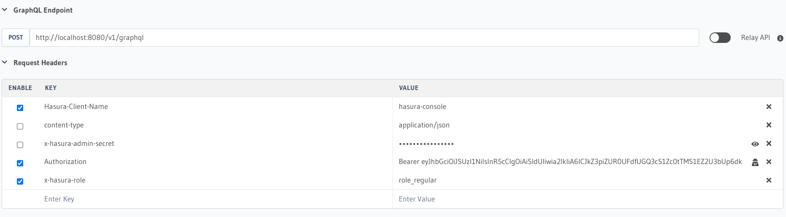
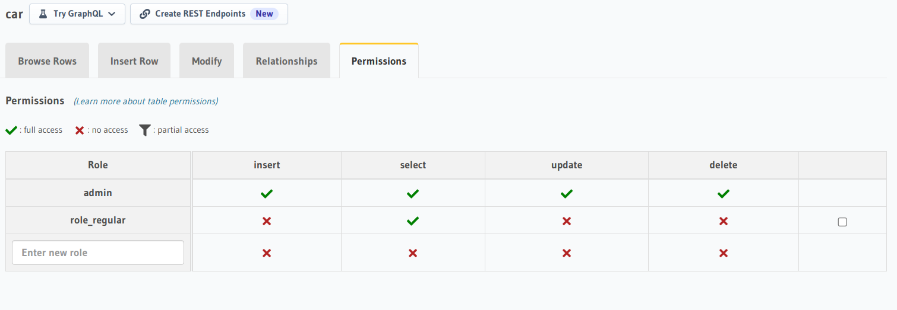

# Hasura + Keycloak

This repository contains sample code to use Keycloak as Authentication Server for Hasura.

## Repository Contents
* `docker-compose.yml`
    * Hasura + PostgreSQL based on the [Getting Started with Docker Guide from Hasura]
    * Keycloak + PostgreSQL

## Getting Started
Assuming you want to follow the [Hasura Introduction Course](https://hasura.io/learn/graphql/hasura/), but instead of Deploying Hasura to Hasura Cloud, you want to use a locally deployed setup with Docker.

Clone this repository and start all the containers via Docker Compose:

```
docker-compose up
hasura console
```

After everything has started, acces the Hasura Console at [localhost:8080](http://localhost:8080/). It asks for a password, which you can find in the variable `HASURA_GRAPHQL_ADMIN_SECRET` inside `docker-compose.yml`.


### Keycloak Configuration
First, change some settings in Keycloak to make working with it easier.

After login, you should be at the "Realm Settings" of the "master" Realm. Go to "Tokens" and change the "Access Token Lifespan" to 1 Day. With that, you won't have to constanlty generate new JWTs while testing.

Next, go to "Client Scopes" -> "Default Client Scopes" and remove all Scopes under "Assigned Default Client Scopes" as well as "Assigned Optional Client Scopes". This makes the generated JWTs smaller.

### Create a "Client"
Instead of creating an "App" on Auth0, we create a "Client" in Keycloak. Go to "Clients" and click on "Create". Enter `hasura` as "Client ID".

### Create Mappers
Hasura expects a certain object structure to be present in the JWT:
```json
{
  ...
  "https://hasura.io/jwt/claims": {
    "x-hasura-default-role": "user",
    "x-hasura-user-id": "a-b-c-d-0123",
    "x-hasura-allowed-roles": ["user"]
  },
  ...
}
```
See [Authentication using JWT in the Hasura Docs](https://hasura.io/docs/1.0/graphql/core/auth/authentication/jwt.html) for more details.

Keycloak needs two things to make this work: first, there must be a "Role" called "user" and then there must be "Mappers" that tell Keycloak how to put this data into the JWT.

#### Create a Role
Keycloak distinguishes between "Realm Roles" and "Client Roles". We will use the latter.

Go to "Clients" -> `hasura` -> Roles. Click on "Add Role", enter the Role Name `user` and click "Save".

Having the Role is not enough, we must assign it to our user. Go to "Users", click on "View all users" and click on "Edit" (There should be only 1 user, our "admin" User). Go to "Role Mappings", select the Client `hasura` next to "Client Roles", select `user` under "Available Roles" and click on "Add selected".

#### Create Mapper for `x-hasura-user-id`
Go to Clients -> `hasura` -> Mappers. Click on "Create" and enter the following values:

|                  |                                                  |
|------------------|--------------------------------------------------|
| Name             | `x-hasura-user-id`                               |
| Mapper Type      | User Property                                    |
| Property         | `id`                                             |
| Token Claim Name | `https://hasura\.io/jwt/claims.x-hasura-user-id` |
| Claim JSON Type  | String                                           |

This mapper will add the `x-hasura-user-id` element to the claims object and fill it with the users Keycloak User Id.

#### Create Mapper for `x-hasura-default-role`
Go to Clients -> `hasura` -> Mappers. Click on "Create" and enter the following values:

|                  |                                                       |
|------------------|-------------------------------------------------------|
| Name             | `x-hasura-default-role`                               |
| Mapper Type      | Hardcoded claim                                       |
| Token Claim Name | `https://hasura\.io/jwt/claims.x-hasura-default-role` |
| Claim value      | `user`                                                |
| Claim JSON Type  | String                                                |

This mapper will add the `x-hasura-default-role` element to the claims object and fill it with the value "user".

#### Create Mapper for `x-hasura-allowed-roles`
Go to Clients -> `hasura` -> Mappers. Click on "Create" and enter the following values:

|                  |                                                        |
|------------------|--------------------------------------------------------|
| Name             | `x-hasura-allowed-roles`                               |
| Mapper Type      | User Client Role                                       |
| Client Id        | `hasura`                                               |
| Multivalued      | ON                                                     |
| Token Claim Name | `https://hasura\.io/jwt/claims.x-hasura-allowed-roles` |
| Claim JSON Type  | String                                                 |

This mapper will add the `x-hasura-allowed-roles` element to the claims object and fill it with the Client Roles we have assigned to our user.

### Obtain JWT from Keycloak

You can get an Access Token in exchange for your username and password (again from `KEYCLOAK_USER` and `KEYCLOAK_PASSWORD` in `docker-compose.yml`) from Keycloak with the following curl Request:

```
curl --request POST \
  --url http://localhost:8081/realms/master/protocol/openid-connect/token \
  --header 'Content-Type: application/x-www-form-urlencoded' \
  --data username=admin \
  --data password=admin \
  --data grant_type=password \
  --data client_id=hasura
```

The response will be a JSON structure that contains a long string in the property `access_token`. Copy it!

### Verify Token is well formed
You can paste the Token at [jwt.io](https://jwt.io) to examine its contents. If everything is set up correctly, you will see the `https://hasura.io/jwt/claims` structure from above inside the Payload.

### Use the Token to query Hasura
Go back to the Hasura Console Web Interface. Under "Request Headers", you can now add an `authorization` Header with the value "`Bearer `" followed by the JWT you copied earlier:

| | |
|-|-|
| authorization | Bearer eyJh... |


## Alternative `HASURA_GRAPHQL_JWT_SECRET` Setup

The `docker-compose.yml` contains a plug-and-play setup to make Hasura aware of the Public Key of the Keycloak Server.

For the sake of completeness, there is an alternative way to set this up, which does not require Hasura to directly talk to Keycloak.

### Get the Public Key
Log into the Keycloak Admin Console and go to "Realm Settings" ->  "Keys" -> "Active". Click on the "Public Key"-Button in the row with the Algorithm `RS256`. A little popup appears which displays the public key. Copy it!

### Configure Hasura to accept Keycloak JWTs
Inside the `docker-compose.yml`, replace the `HASURA_GRAPHQL_JWT_SECRET` with a line similar to the following:
```
HASURA_GRAPHQL_JWT_SECRET: '{ "type": "RS256", "claims_namespace": "https://hasura.io/jwt/claims", "claims_format": "json", "key": "-----BEGIN PUBLIC KEY-----\n...\n-----END PUBLIC KEY-----" }'
```
Replace the `...`  with the Key you just copied.

Now you have to restart Hasura (it's easiest to restart the entire `docker-compose up` process via `Ctrl+C`) for the changes to take effect.




